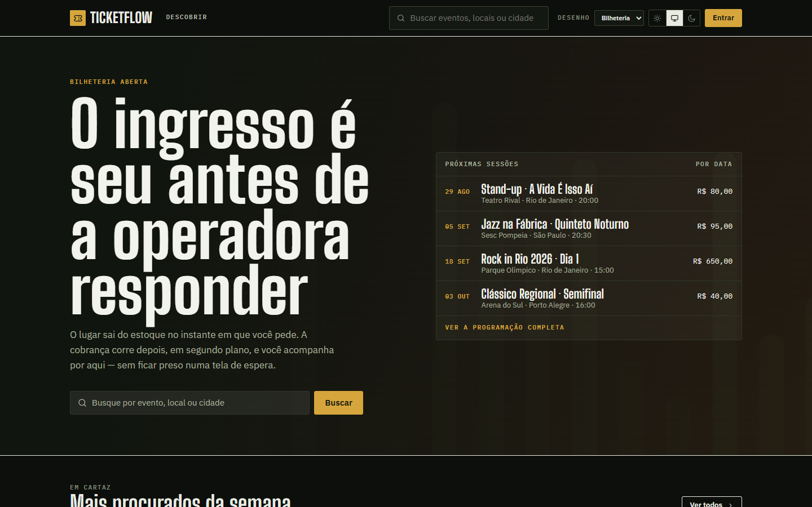
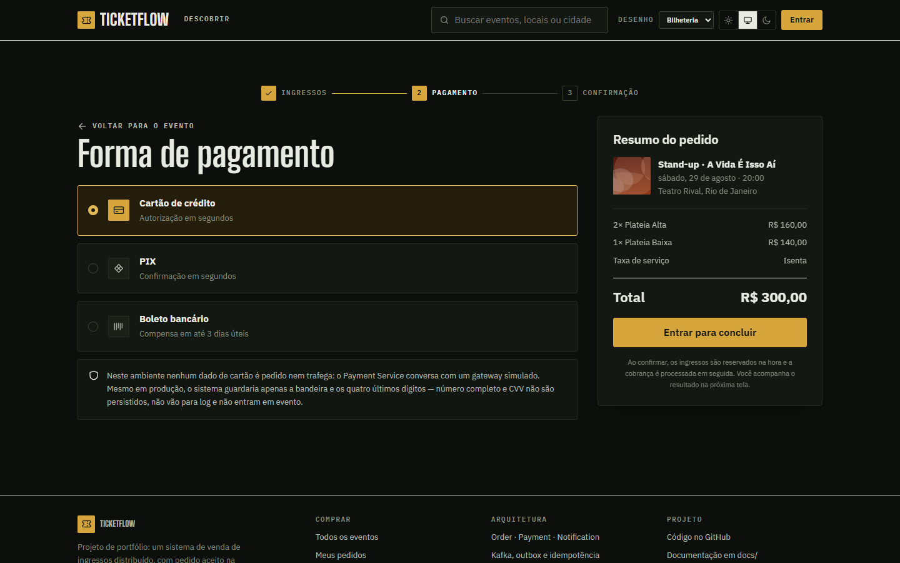
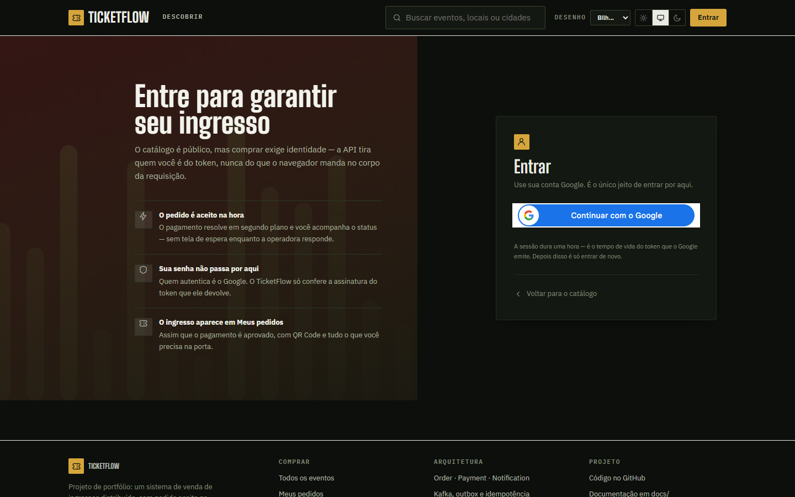
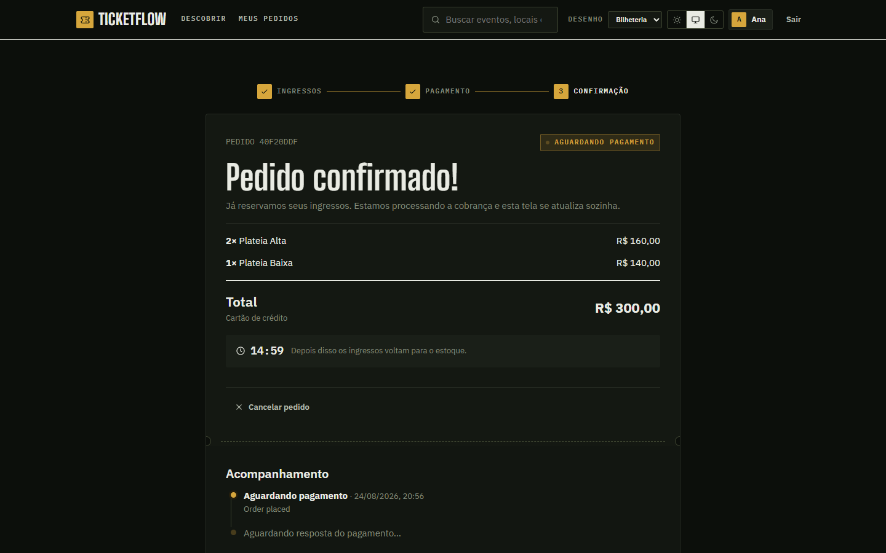
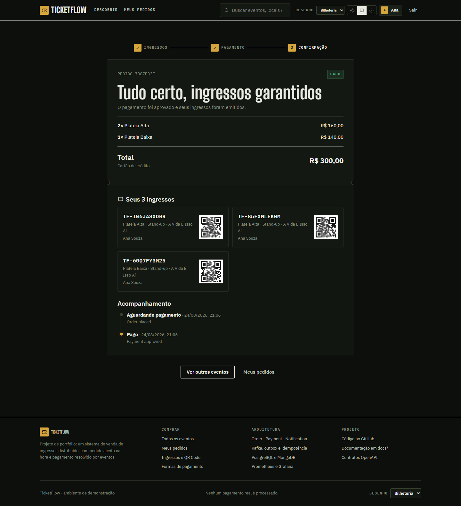
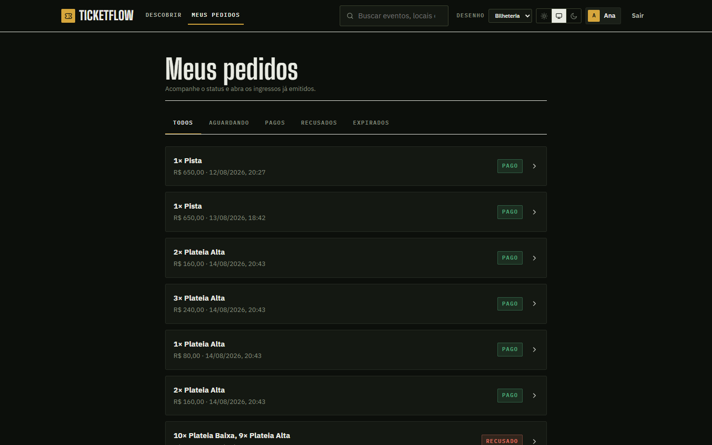
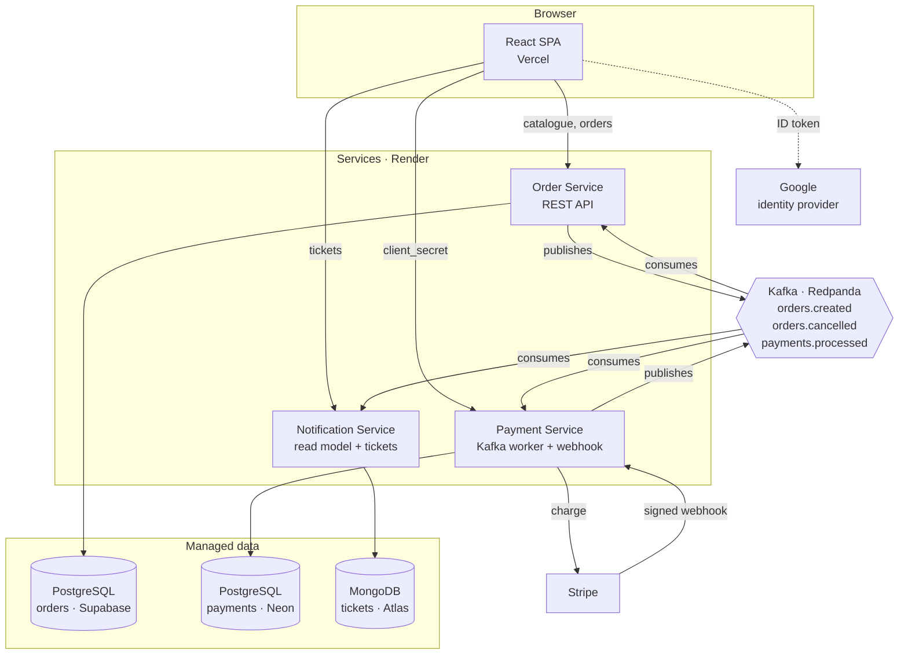
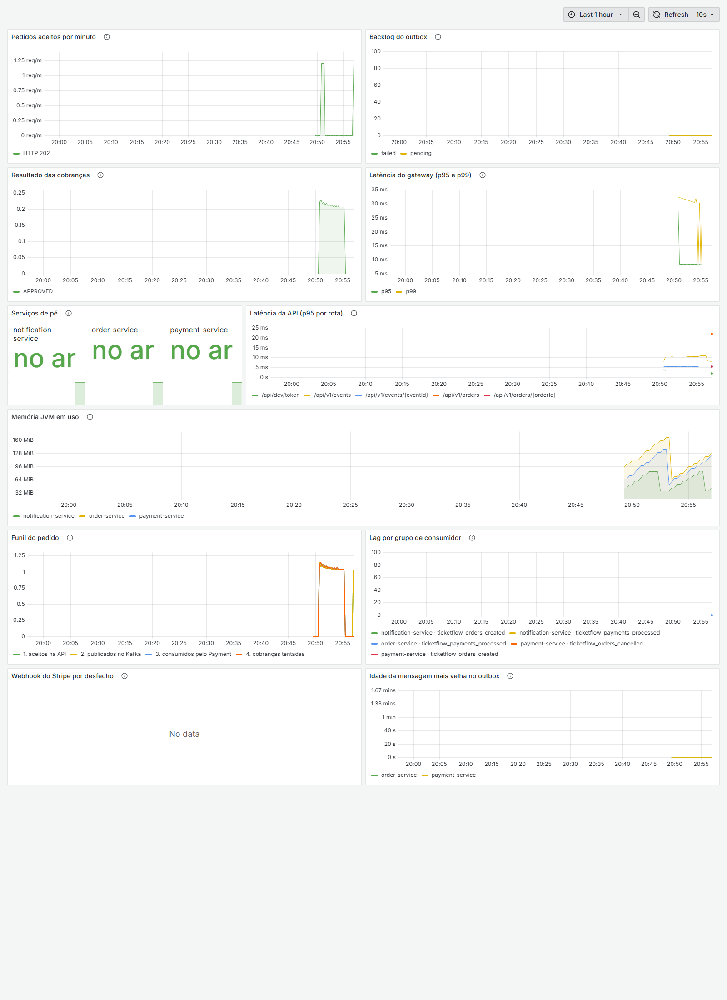

# TicketFlow

[](https://github.com/patrickpriebe/ticketflow/actions/workflows/ci.yml)

A distributed ticket-selling system: three Spring Boot microservices that talk only
through events, two databases with different jobs, a React frontend with no runtime
dependencies beyond React itself, and infrastructure that comes up with one command.

**Live: https://ticketflow-br.vercel.app**

The whole project rests on a single decision: **an order is accepted without waiting
for the payment.** The API answers `202 Accepted` in milliseconds, the charge happens
later in another process, and the customer watches the status change. Everything else
in this repository exists to support that premise honestly — including the parts that
make it harder.

---

## Table of contents

- [What it does](#what-it-does)
- [Architecture](#architecture)
- [Tech stack](#tech-stack)
- [The rule that is never broken](#the-rule-that-is-never-broken)
- [Data model](#data-model)
- [Event flow](#event-flow)
- [Payments](#payments)
- [Identity and security](#identity-and-security)
- [Frontend](#frontend)
- [Observability](#observability)
- [CI/CD](#cicd)
- [Kubernetes](#kubernetes)
- [Cloud deployment](#cloud-deployment)
- [Running locally](#running-locally)
- [Testing strategy](#testing-strategy)
- [Engineering decisions worth reading](#engineering-decisions-worth-reading)
- [Known limits](#known-limits)

---

## What it does

A customer browses a public catalogue, picks ticket categories, signs in with Google,
and places an order. The order is accepted immediately and the tickets are reserved.
The payment resolves in the background; when it is approved, the tickets are issued
and appear with a QR code.

| Flow | What the customer sees |
|---|---|
| Browse | Public catalogue, filters by city, price and text — no login required |
| Cart | Multiple ticket categories per order, kept across reloads |
| Sign in | Google. The site never sees a password |
| Checkout | Payment method, order summary, `202` in milliseconds |
| Order page | Status starts at *awaiting payment* and changes on its own |
| Card | Stripe Elements confirms the card without the number touching our servers |
| Tickets | Issued after approval, listed with QR code |

---

## Product tour

Every screenshot below is generated by a script that drives a real browser against a
running stack — [`scripts/screenshots/capture.mjs`](scripts/screenshots/capture.mjs).
Nothing is staged: the order being photographed is a real order, it crosses Kafka, and
the *paid* screenshot only exists because the Payment Service actually settled it. The
script waits for the status badge to change rather than sleeping a fixed time, so if
the pipeline breaks, the capture fails instead of lying.

```bash
docker compose --profile apps up -d
cd frontend && npm run dev
node scripts/screenshots/capture.mjs
```

### Browsing

| | |
|---|---|
|  |  |
| **Home.** The catalogue is public — asking for a login before showing what is on sale would cost customers. | **Discover.** Filters by city, price and text, all reflected in the URL so a filtered view can be shared. |

The images are real photographs of the venues the catalogue names — Parque Olímpico,
Theatro Municipal, Sesc Pompeia, Marina da Glória — freely licensed from Wikimedia
Commons and served by the site itself. The events are fictional, so there is no photo of
*that* show; the place is what is real.

Only empty venues qualify. The Creative Commons licence settles the photographer's
rights; it does not settle the rights of people in the frame, and attribution cannot buy
those. Where only crowd photos existed, the event keeps a poster drawn deterministically
from its own id — which is also what covers any event added after the seed.

### Choosing tickets

| | |
|---|---|
|  |  |
| **Event page.** Description, venue and the ticket selector, with remaining inventory per category. | **Cart.** Several categories per order. The "+" disables at the contract's limit of ten categories, with the reason in the tooltip. |

### Paying

| | |
|---|---|
|  |  |
| **Checkout.** Payment method and summary. The button reads *sign in to finish* when there is no session — the wall is honest about itself instead of failing after the click. | **Sign in.** Google only. The site never sees a password; the services validate a signed token and nobody issues one. |

The sign-in screenshot comes from the deployed site, because that is the only place the
Google button exists. Locally the provider is not configured and the same screen falls
back to a development issuer — one screen, two mechanisms, and nothing else in the
frontend changes.

### The premise, made visible

| | |
|---|---|
|  |  |
| **Right after `POST /orders`.** The order exists, the tickets are reserved, the deadline is counting down — and nobody has been charged yet. The API answered `202` in milliseconds. | **A few seconds later.** The charge crossed Kafka, the Payment Service settled it, the tickets were issued. The page changed on its own; nothing on screen ever blocked on the gateway. |

This pair is the whole project in two images. The gap between them is the outbox relay,
a Kafka topic, a payment strategy, a provider call and an idempotent consumer — none of
which the customer waits for.

| | |
|---|---|
|  |  |
| **My orders.** Filtered by status, showing the identity derived from the token — never from a field the browser could tamper with. | **Light theme.** Three states, not two: light, dark, and *system*. Without the third, whoever chose once is stuck with that choice. |

---

## Architecture



Three services, each owning its data, communicating exclusively through Kafka. The
browser talks to all three; **the services never talk to each other.**

| Service | Role | Storage | HTTP surface |
|---|---|---|---|
| **Order** | Catalogue, orders, inventory reservation | PostgreSQL | `/api/v1/events`, `/api/v1/orders` |
| **Payment** | Charges the provider, settles from webhooks | PostgreSQL | `/webhooks/stripe`, `/api/v1/payments/by-order/{id}` |
| **Notification** | Read model, issues tickets | MongoDB | `/api/v1/tickets` |

---

## Tech stack

| Layer | Choice | Notes |
|---|---|---|
| Language | **Java 21** | Records, sealed switch, pattern matching |
| Framework | **Spring Boot 3.5.3** | Web, Data JPA, Security, Actuator |
| Messaging | **Spring Cloud Stream 2025.0.0** + Kafka binder | `StreamBridge` to publish, `Consumer<Message<String>>` to consume |
| Transactional data | **PostgreSQL** + Flyway | Orders and payments, separate databases |
| Documents | **MongoDB** | Tickets and order snapshots |
| Payments | **Stripe** (`stripe-java` 29.2.0) | PaymentIntents, signed webhooks, Elements |
| Identity | **Google OAuth 2.0** / OIDC | Resource servers validate; nobody issues |
| Metrics | Micrometer → **Prometheus** → **Grafana** | 11 provisioned panels |
| Frontend | **React 18** + **TypeScript 5.7** + **Vite 6** | Zero runtime dependencies beyond React |
| Tests | JUnit 5, Mockito, AssertJ, **WireMock**, **EmbeddedKafka** | 205 tests |
| CI/CD | **GitHub Actions** | Build, test, secret scan, contract lint, image build |
| Orchestration | **Docker Compose** (local) · **Kubernetes** manifests · **Render** (deployed) | |

Each service is an independent Maven project with its own `pom.xml` and `mvnw`.
There is no parent POM and no shared events module: coupling the three at compile
time would undo much of the point of separating them at runtime.

---

## The rule that is never broken

> **No synchronous call between Order, Payment and Notification.**

If a `RestTemplate`, `WebClient` or `FeignClient` ever points from one service to
another, that is an architecture bug. The only permitted outbound HTTP is the Payment
Service calling the external gateway.

This rule shaped a real decision late in the project. Stripe Elements needs the
PaymentIntent's `client_secret`, which is born inside the Payment Service — and the
browser only talked to Order and Notification. Three options existed:

1. Order Service fetches it from Payment — **forbidden**, that is service-to-service HTTP.
2. Ship the `client_secret` through a Kafka event — spreads a payment credential across
   another service's topic and database, and teaches Order what Stripe is.
3. **The browser talks to the Payment Service directly.**

The third was chosen. It does not break the rule — the rule forbids *service calling
service*, not *browser calling service*. The browser now talks to three services, and
the three still do not talk to each other.

---

## Data model

**Transactional data goes to PostgreSQL. Documents and history go to MongoDB.** An
entity is not pushed into Mongo just because Mongo code happens to be nearby.

### PostgreSQL — orders

| Table | Purpose |
|---|---|
| `ticket_events`, `ticket_categories` | Catalogue and inventory counters |
| `orders`, `order_items` | The order and its lines |
| `order_status_history` | Every transition, with its cause |
| `outbox_messages` | Events written in the same transaction as the business write |
| `processed_events` | Inbox: what this consumer group already handled |

### PostgreSQL — payments

| Table | Purpose |
|---|---|
| `payments` | One row per order, `UNIQUE(order_id)` as the last guard against double charging |
| `payment_attempts` | Every gateway call, with outcome, latency and masked payload |
| `payment_webhook_events` | Inbox for provider callbacks, PK `(provider, event_id)` |
| `outbox_messages`, `processed_events` | Same pattern as Order |

### MongoDB — notifications

| Collection | Purpose |
|---|---|
| `order_snapshots` | CQRS read model, built from `ORDER_CREATED` |
| `tickets` | Issued tickets with QR payload |
| `notifications` | What was sent, and when |
| `processed_events` | Inbox, with a 30-day TTL |

Money is `BigDecimal` in Java and `NUMERIC(12,2)` in PostgreSQL. Never `double`.

Card data is never persisted, never logged and never published in an event — only
the brand and the last four digits.

Full modelling notes: [docs/02-modelagem-dados.md](docs/02-modelagem-dados.md).

---

## Event flow

Three topics, each with a dead-letter queue:

```
ticketflow.orders.created       → ticketflow.orders.created.dlq
ticketflow.orders.cancelled     → ticketflow.orders.cancelled.dlq
ticketflow.payments.processed   → ticketflow.payments.processed.dlq
```

The dead-letter topics have one partition while the business topics have three, so every
consumer sets `dlq-partitions: 1`. Without it the binder writes to the same partition
index it read from, and a message from partition 2 dies with *"partition 2 is not present
in metadata"* — the poison message lost by the mechanism built to keep it.

Every message carries a versioned envelope (`eventId`, `eventType`, `occurredAt`,
`producer`, `data`), validated by JSON Schema in [`contracts/events/`](contracts/events/).
The partition key is always the `orderId`, so everything about one order stays ordered.

### The transactional outbox

`POST /orders` writes the order **and** the `ORDER_CREATED` event in the same
transaction, then answers `202`. A separate relay polls the outbox with
`FOR UPDATE SKIP LOCKED` and publishes to Kafka.

`SKIP LOCKED` is what allows several instances of the service to run the relay at
once without two of them publishing the same row.

**The relay publishes after committing, never before.** That makes delivery
*at-least-once*: if the process dies between the send and the `UPDATE`, the message
goes out twice. That is the correct trade — consumers deduplicate, but a lost event is
unrecoverable.

### Idempotency

Every Kafka consumer checks `processed_events` before acting. Delivery is at-least-once;
assuming exactly-once is a defect.

The order lifecycle:

```
POST /orders ──► PENDING + event in outbox        (one transaction)
                        │
                   relay, ~1s
                        ▼
            ticketflow.orders.created             (key = orderId)
                        │
          ┌─────────────┴─────────────┐
          ▼                           ▼
   Payment Service              Notification Service
   charges the provider         builds the read model
          │
          ▼
   ticketflow.payments.processed
          │
          ├────────────► Order: PAID or REJECTED, inventory settles
          └────────────► Notification: issues tickets
```

---

## Payments

### One strategy per method

Adding a payment method means writing a new `PaymentStrategy`, not another branch in
an `if/else`. The registry refuses to start if any method lacks a strategy — a boot
error, not a customer's failed purchase.

The strategy also decides whether a timeout may be retried: card and PIX yes, boleto
no, because a retry would generate a second boleto.

### Three outcomes, not two

This distinction carries the whole service:

| Outcome | Meaning | What happens |
|---|---|---|
| `REJECTED` | The provider said no | Publishes `PAGAMENTO_RECUSADO` |
| `ACCEPTED` | The provider took it, the answer comes later | Publishes nothing; waits for the webhook |
| `FAILED` | Timeout or 5xx — **nobody knows if money moved** | Publishes nothing, records nothing, lets the message be redelivered |

Turning "the gateway did not answer" into "your card was declined" would be a lie to
the customer. `ACCEPTED` had to exist because of boleto: calling it approved would
hand out a ticket nobody paid for; calling it failed would cancel a valid order.

### Stripe

- **PaymentIntents** with idempotency keys, so a retried call cannot charge twice.
- **Webhook signature verified over the raw body** with HMAC. Without the secret the
  endpoint answers `503` and refuses everything — accepting unverified callbacks would
  let anyone forge a payment approval.
- **Card confirmation happens in the browser** through Stripe Elements. The card
  number goes straight to Stripe in an iframe; our code only ever touches the
  `client_secret`, which authorises that one charge and nothing else.
- The `client_secret` is **never persisted**. It is read from Stripe on demand by the
  charge id we already store, and only while there is still something to confirm.

A simulated gateway (WireMock) remains available for local development, so the whole
system runs without an account at any provider.

---

## Identity and security

The services are **resource servers**: they validate tokens and never issue them.
Storing passwords would be assuming a risk that does not belong to them.

### The validation most tutorials forget

A valid signature and the right issuer prove that Google issued the token. They do
**not** prove it was issued for us. Google signs tokens for everyone — any registered
application gets a legitimate token with the same signature and the same `iss`. And
since Google's `sub` is the same across applications, such a token would open the
person's real account here.

So `audience` is compared against our client id, and **the service refuses to boot**
if an issuer is configured without one. Getting this wrong breaks no test and shows up
in no code review — the service starts, answers, and is simply open.

### Identity is derived, not taken raw

The domain uses UUIDs; an identity provider is not obliged to. Google returns a number.
All three services apply the **same** rule — a `sub` that is already a UUID passes
through, otherwise the id is derived from `issuer|sub`.

The issuer is part of the derivation because two providers can use the same `sub` for
different people, and without it that eventually becomes a merged account.

All three sides have a test with the same pinned vector, so divergence breaks the
build instead of losing tickets in production.

### An idempotency key belongs to whoever sent it

`Idempotency-Key` was unique across the whole `orders` table, and `POST /orders`
replays the order that owns the key. Those two facts together meant that sending
`Idempotency-Key: order-1` — a value two people pick without coordinating — answered
`200` with the *other customer's* order: their name, their e-mail, what they bought,
what they paid. No token of theirs, no probing of ids, nothing in the logs that looks
like an attack.

The key is now scoped to the customer, in the lookup and in the unique constraint
alike. Two people using `order-1` stopped being a conflict, and a key can only ever
replay an order of whoever sent it.

The lesson generalises past this bug: **any value the client chooses is an input, and
looking something up by it without scoping it to the caller is an authorisation
decision made by accident.**

### Metrics are not public

`/actuator/prometheus` was open on every service. Locally that is fine — the Prometheus
in the compose file scrapes it. On Render the services answer directly on the internet
and nothing scrapes them, so the same route handed anyone the order volume, the amount
approved and declined, every API route and the exact JVM version.

It is now behind `ticketflow.observability.public-metrics`, which defaults to **false**
and is turned on only where a scraper exists — the compose file and the Kubernetes
ConfigMap. Health probes stay open, because Render and Kubernetes call them before any
token exists.

### The browser gets security headers

The site ships a **Content-Security-Policy** that names the only origins it needs
(Stripe, Google Identity, Google Fonts), plus `frame-ancestors 'none'`, `nosniff`,
HSTS and a `Referrer-Policy`. The session token lives in `localStorage`, which is a
deliberate trade-off for a SPA — and the CSP is what keeps that trade-off cheap, since
an injected script is the way a `localStorage` token gets stolen.

The theme script moved out of `index.html` to make this possible: a `script-src` that
allows inline code allows injected code too, and pinning the snippet's hash instead
breaks silently every time the snippet is edited.

### Secrets

Two layers, both tested in both directions:

- A **pre-commit hook** that scans by credential *format* — `sk_live`, `whsec_`, `ghp_`,
  `AKIA`, connection strings with passwords, private keys.
- A **CI job** that scans the entire history, prints the commit and file, and never the
  matching line.

Dangerous flags default to safe, and secrets have no default at all. The dev token
issuer — which signs a token for any email without a password — is `false` by default,
because forgetting a variable should be harmless rather than catastrophic.

---

## Frontend

```bash
cd frontend && npm install && npm run dev
```

React 18, TypeScript in strict mode, Vite. **No runtime dependency beyond `react` and
`react-dom`** — the router, the cart, the theme system and the Stripe and Google
integrations are about sixty lines each, and a package for any of them would cost more
attention than it saves.

Seven routes with real URLs: home, discover, event, checkout, order, my orders, sign in.

- **A design system in CSS custom properties.** Every colour comes from
  `styles/tokens.css`; no component writes a hex value.
- **Three-state theming** — light, dark, and *system*. Without the third, whoever chose
  once is stuck with that choice, and almost nobody returns to fix it.
- **Real venue photographs, with a drawn poster as the fallback.** Freely licensed images
  of the real places the catalogue names, served by the site itself. Only empty venues
  qualify: the licence settles the photographer's rights, not the rights of people in the
  frame, and attribution cannot buy those.
- **Polling, not WebSocket**, because that is what the contract defines: `POST` answers
  `202` and the client polls. It stops on its own once the order reaches a final state,
  and pauses while the tab is hidden.

The order page exists to make the premise visible: the status starts at *awaiting
payment* and changes by itself, with nothing on screen ever having blocked on the
gateway.

More in [docs/04-frontend.md](docs/04-frontend.md).

---

## Observability

```bash
docker compose --profile apps --profile observability up -d
```

Grafana at http://localhost:3002 comes up with the datasource and the **TicketFlow —
visão geral** dashboard provisioned. No login, nothing to click.



That capture is real traffic against the local stack, produced by the same script that
generates the product screenshots (`node scripts/screenshots/capture.mjs grafana`).

The webhook panel reads *No data* on purpose: locally the payment provider is the
simulated gateway, so no Stripe callback ever arrives. It fills up in the deployed
environment, which is the only place a real webhook exists.

Eleven panels, each answering a question that only exists because the system is
asynchronous:

| Panel | The question it answers |
|---|---|
| Order funnel | accepted → published → consumed → charged. **Which step did it stop at?** |
| Consumer lag | Is everything actually being processed? |
| Outbox backlog | Did the relay stop while the API kept answering `202`? |
| Oldest pending message | Is this a traffic spike or an incident? |
| Charge outcomes | `TIMEOUT` and `ERROR` rise first when a provider starts failing |
| Gateway latency (p95/p99) | The read timeout is 5s — when p99 approaches it, timeouts begin |
| Webhook outcomes | Is the provider's answer getting in, or being refused? |
| `POST /orders` latency | It must stay low precisely because it does not wait for payment |

Two of these were built after debugging production by hand. The funnel is literally the
reasoning used to prove an order had crossed Kafka — scraping `/actuator/prometheus`
and comparing counters. The oldest-pending gauge exists because counts mislead: fifty
messages two seconds old is traffic, one message ten minutes old is an incident, and
both look identical on a quantity graph.

Business metrics are registered in the infrastructure layer, never in use cases. The
domain does not know Prometheus exists.

---

## CI/CD

**GitHub Actions.** There is no Jenkins in this project — the pipeline lives in
[`.github/workflows/ci.yml`](.github/workflows/ci.yml) and runs on every push and pull
request, with in-progress runs cancelled when a new commit arrives.

Four jobs:

| Job | What it does |
|---|---|
| **services** | Matrix over the three services: `./mvnw verify` on JDK 21 with dependency caching, uploading test reports as artifacts |
| **secrets** | Scans the **entire git history** for credential formats, with `fetch-depth: 0` |
| **contracts** | Lints the OpenAPI document with Redocly and validates the event JSON Schemas |
| **images** | Builds the three Docker images with Buildx |

A second workflow, [`keep-awake.yml`](.github/workflows/keep-awake.yml), pings the
deployed services on a schedule. It exists because of a real constraint documented
below, not as decoration.

---

## Kubernetes

Manifests live in [`infra/k8s/`](infra/k8s/) and describe the same three services for a
cluster:

| File | Contents |
|---|---|
| `00-namespace.yaml` | `ticketflow` namespace |
| `01-config.yaml` | `ConfigMap` for configuration, `Secret` for credentials |
| `10/11/12-*.yaml` | One `Deployment` + `Service` per microservice |

Each Deployment runs **2 replicas** with requests of `200m` CPU / `512Mi` and a
`768Mi` limit, liveness and readiness probes on the Actuator endpoints, and all
configuration injected from the ConfigMap and Secret — no defaults baked into the image.

Two replicas is not a decoration: it is what the outbox relay's `FOR UPDATE SKIP LOCKED`
was written for, and what makes the consumer-group partition assignment meaningful.

The `kubernetes` Spring profile has **no default values** for anything, on purpose. A
missing variable must break the boot loudly rather than silently connect to something
unintended.

> These manifests are written and reviewed but the deployed environment runs on Render,
> which is a container platform rather than a Kubernetes cluster. Applying them requires
> a cluster and a registry; the notes are in [`infra/k8s/README.md`](infra/k8s/README.md).

---

## Cloud deployment

| Piece | Provider | Notes |
|---|---|---|
| Frontend | **Vercel** | Rewrites route `/api/v1/tickets` to Notification, `/api/v1/payments` to Payment, the rest to Order |
| Services | **Render** | Blueprint in [`render.yaml`](render.yaml), Docker runtime, health checks on readiness |
| Orders DB | **Supabase** | Session pooler — the direct connection is IPv6-only |
| Payments DB | **Neon** | Separate provider, because database-per-service is the point |
| Tickets DB | **MongoDB Atlas** | M0 |
| Kafka | **Redpanda Cloud** | SASL_SSL + SCRAM-SHA-256, with per-topic and per-group ACLs |

No secret lives in this repository. Everything sensitive is `sync: false` in the
blueprint, which makes Render ask for it and keep it in its own panel.

Three constraints shaped this setup, and they are worth stating because they are the
kind of thing that only shows up when you actually deploy:

- **Free instances sleep.** Payment and Notification are Kafka consumers — nobody makes
  HTTP requests to them, so without the scheduled ping they would never wake, and an
  order would sit `PENDING` forever while the site looked fine.
- **Connection ceilings are low.** Supabase's free pooler accepts 15 connections; a pool
  of 10 per instance means the second instance to start cannot open its pool and dies
  during Flyway. The pool is capped at 5.
- **Environments must not share a consumer group.** With one broker for local and
  deployed, Kafka splits partitions between them and half the orders are processed by
  the wrong environment — with no error anywhere. Groups carry an environment suffix.

---

## Running locally

Only Docker is required for the infrastructure; JDK 21 to run the services from source.

```bash
docker compose up -d
```

Brings up PostgreSQL, MongoDB and Kafka, applies migrations, creates topics and opens
the Kafka UI.

```bash
docker compose --profile apps up -d --build
```

Adds the three services and the simulated payment gateway.

| Service | Address | Credentials |
|---|---|---|
| PostgreSQL | `localhost:5433` | `ticketflow` / `ticketflow` |
| MongoDB | `localhost:27017` | `root` / `root` |
| Kafka | `localhost:9092` | — |
| Kafka UI | http://localhost:8085 | — |
| Prometheus | http://localhost:9091 | profile `observability` |
| Grafana | http://localhost:3002 | profile `observability`, opens straight in |

> **PostgreSQL is on 5433, not 5432**, because 5432 is usually taken by a native
> install. Inside the Docker network it is still `postgres:5432`.

These are local development credentials and are good for nothing else.

### Seeing the whole system work

The simulated gateway refuses any charge above 2000, so both branches of the flow are
reachable without configuring anything: a cheap order is approved, an expensive one is
declined, and the inventory settles differently in each case.

Raw messages are visible in the [Kafka UI](http://localhost:8085); what the Payment
Service sent to the gateway, including the idempotency key, at
http://localhost:8090/__admin/requests.

---

## Testing strategy

**205 tests.** Surefire runs `*Test` (fast, no Docker); Failsafe runs `*IT`.

| Service | Unit | Integration |
|---|---|---|
| Order | 79 | `*IT` with EmbeddedKafka and a real PostgreSQL |
| Payment | 72 | `*IT` with EmbeddedKafka and WireMock |
| Notification | 23 | `*IT` with EmbeddedKafka and MongoDB |

Principles the suite holds to:

- **Every use case has a unit test** with plain fakes — no Spring context, no Docker.
- **Every external integration is tested for success, decline, timeout and 5xx.** The
  happy path alone does not count as covered.
- **Messaging is tested with EmbeddedKafka, not Testcontainers**, so the suite runs on a
  machine without a working Docker socket and in CI without a service container.
- Some tests exist to stop a specific disaster from recurring: the pinned identity
  vector across three services, the boot-time refusal of an unsafe auth configuration,
  and the assertion that a webhook without an `aud` claim is refused rather than
  crashing.

---

## Engineering decisions worth reading

A few choices that are easy to get wrong and were deliberate here.

**`UnitOfWork` instead of `@Transactional` on the use case.** The order insert and the
outbox insert need the same transaction, but annotating the use case would couple it to
Spring. The port is implemented with `TransactionTemplate` in the infrastructure layer,
and the unit test injects a version that simply runs the block.

**Idempotency by constraint, not by a prior `SELECT`.** The `SELECT` is an
optimisation; `uq_orders_idempotency_key` is the guarantee. If two requests with the
same key race, the loser reloads the winner's order and returns `200`. There is a test
for that race.

**`@Scheduled` and `@Transactional` are never on the same class.** The timer would call
the method on `this` and bypass the proxy. The relay broke exactly that way, with "no
transaction is known to be in progress", and only showed up when running for real. The
trigger lives in its own bean.

**One file per Spring Data repository interface.** Grouping several as nested interfaces
makes the scan miss them, and the error surfaces only at boot as "No qualifying bean".

**Not-yours and not-found answer the same.** Asking for another customer's order
returns the same response as asking for one that does not exist. A `403` would confirm
the order's existence to whoever is probing ids, and the mere fact that an order exists
is already someone else's information.

---

## Known limits

Recorded so they do not look like oversights.

- **Card payments require the browser.** PIX and boleto settle through the webhook;
  card needs Stripe Elements, which is implemented, but there is no server-side
  fallback for a customer who closes the page mid-confirmation.
- **A refund is shown on screen but not e-mailed.** The cancelled order page says
  which of three things happened — nothing was charged, the amount was refunded, or
  the refund is still in flight — by asking the Payment Service directly from the
  browser. What is missing is the message that reaches someone who is not looking at
  the page.
- **Nothing is rate limited.** An authenticated customer can place orders in a loop and
  hold real inventory for the length of the payment window. The expiry sweep bounds the
  damage rather than preventing it, and the fix belongs at the edge (Render, or a
  gateway), not in a `for` loop inside the use case.
- **The QR code on a ticket is a drawing, not a scannable code.** Generating a real one
  needs Reed-Solomon error correction, and the library that does it weighs more than
  the rest of the screen. The payload the gate would read is the ticket code itself.
- **The catalogue has no administrative path.** Events are seeded locally and were
  inserted by hand in the deployed environment.
- **Redpanda Cloud is on trial credit**, not a permanent free tier.

Product roadmap and what is deliberately out of scope:
[docs/05-roadmap-produto.md](docs/05-roadmap-produto.md).

---

## Documentation

- [Architecture](docs/01-arquitetura.md) — why Kafka, why an outbox, why two databases
- [Data modelling](docs/02-modelagem-dados.md) — the tables, the collections, the reasoning
- [Kafka events](docs/03-eventos-kafka.md) — topics, envelope, retry, DLQ
- [Frontend](docs/04-frontend.md) — design system, theming, screen decisions
- [Product roadmap](docs/05-roadmap-produto.md) — what does not exist yet, and what stays out
- [API contract](contracts/openapi/order-service.yaml) — OpenAPI 3.0

> Documentation and identifiers are in English. Code comments are in Portuguese, which
> is how the codebase reads today — with the single deliberate exception of the event
> types `PAGAMENTO_APROVADO` and `PAGAMENTO_RECUSADO`, fixed project vocabulary that is
> never translated.
